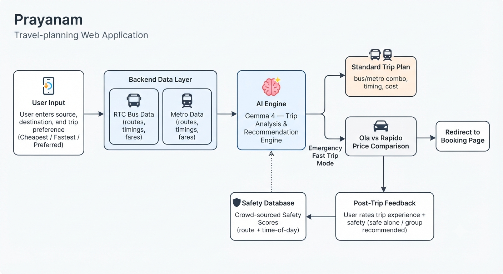
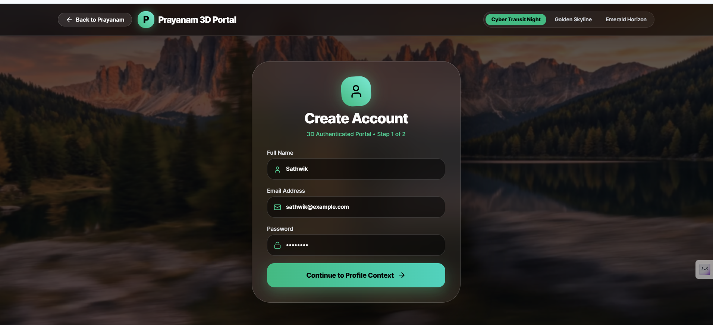
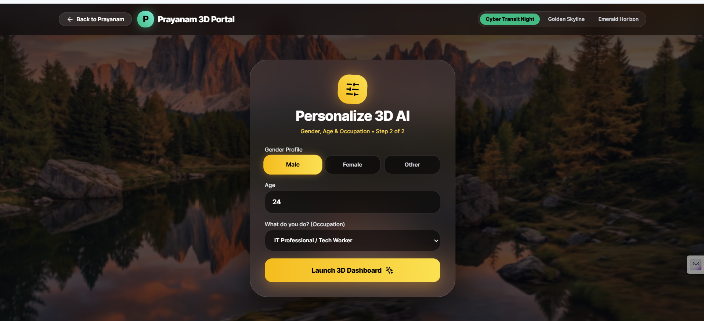

<h1 align="center">Prayanam 🚌🚇</h1>

<p align="center">
  <b>Hyderabad's Smart, Safe & Affordable Trip Planner</b><br>
  Plan your journey across RTC Buses, Metro, Ola & Rapido — cheapest, fastest, and safest.
</p>

<p align="center">
  
  
  
  
</p>

---

## 📖 About Prayanam

**Prayanam** (meaning *"journey"* in Telugu) is a Hyderabad-based travel planning platform that helps commuters choose the **cheapest**, **fastest**, or **most convenient** route for their trip — combining data from **RTC (Telangana State Road Transport Corporation) buses** and the **Hyderabad Metro**.

Unlike generic map apps, Prayanam is built specifically around **local transit data** and adds a layer that most transport apps ignore: **real, community-driven safety feedback** — especially important for women's safety and late-night travel, while remaining inclusive of all commuters.

Prayanam is powered by **Gemma 4**, which drives the trip analysis, recommendation logic, and natural-language handling behind the scenes.

---

## ✨ Key Features

### 🧭 Smart Route Planning
- Choose your preference: **Cheapest**, **Fastest**, or **User-Preferred** route.
- Combines **RTC bus routes, timings, and fares** with **Metro routes, timings, and fares** from a backend datasheet.
- Backend engine analyzes all available data to recommend the best possible trip combination.

### 🚕 Emergency / Fast Trip Mode
- For urgent trips, Prayanam compares real-time prices between **Ola** and **Rapido**.
- Shows a clear side-by-side price comparison.
- **Directly redirects the user to the Ola or Rapido booking page** for instant booking — this is one of Prayanam's standout features, removing the need to switch apps manually.

### 🛡️ Safety-First Feedback System
- After completing a trip, users are asked to rate:
  - Was the trip **good or bad**?
  - Was it **safe to travel alone**, or **better with a group**?
- Feedback is aggregated to build **route-level and time-of-day safety scores**.
- Special focus on **women's safety** and **night travel safety**, while also accounting for **men's safety concerns** — making Prayanam inclusive for all commuters.
- Over time, this crowd-sourced safety data helps future users make informed, safer travel decisions.

### 🗄️ Backend Data Engine
- RTC and Metro route, timing, and fare data are maintained in a structured backend datasheet.
- The recommendation engine (powered by **Gemma 4**) processes this data to generate optimal trip suggestions in real time.

---

## 🧩 How It Works

```
1. User opens Prayanam and enters source & destination.
2. User selects preference: Cheapest / Fastest / Preferred Route.
3. Backend fetches RTC + Metro data from the datasheet.
4. Gemma 4 analyzes routes, timings, and fares → generates the best trip plan.
5. (If "Emergency/Fast" is selected) → Ola vs Rapido prices are compared
   → user is redirected to the cheaper/faster option's booking page.
6. After trip completion → user gives feedback (experience + safety rating).
7. Feedback is stored and used to improve future safety recommendations.
```

<p align="center">
  
</p>

---

## 📸 Screenshots

<p align="center">
  
  
  
</p>

<p align="center">
  
  
</p>

---

## 🛠️ Tech Stack

| Layer | Technology |
|---|---|
| AI / Trip Analysis Engine | **Gemma 4** |
| Backend Data | RTC & Metro Datasheet (routes, timings, fares) |
| Ride Comparison | Ola & Rapido price comparison + redirect |
| Frontend | *(add your framework here, e.g. React / HTML-CSS-JS)* |
| Backend | *(add your framework here, e.g. Node.js / Flask / Django)* |
| Database | *(add your DB here, e.g. MySQL / MongoDB / Firebase)* |

---

## 🚀 Getting Started

### Prerequisites
- *(List requirements, e.g. Node.js v18+, Python 3.10+, etc.)*

### Installation
```bash
git clone https://github.com/sathwik-luffy/prayanam_AI_guid.git
cd prayanam_AI_guid
# install dependencies
npm install
```

### Running the App
```bash
npm start
```

---

## 🗺️ Roadmap
- [ ] Live RTC bus tracking (GPS-based ETA)
- [ ] Live Metro crowd-density indicator
- [ ] Women's safety helpline SOS button
- [ ] Multi-language support (Telugu, Hindi, English)
- [ ] Offline mode for low-connectivity areas

---

## 🤝 Contributing
Contributions are welcome! Please fork the repo and submit a pull request, or open an issue for bugs and feature requests.

---


---

<p align="center">Made with ❤️ in Hyderabad, powered by <b>Gemma 4</b></p>
